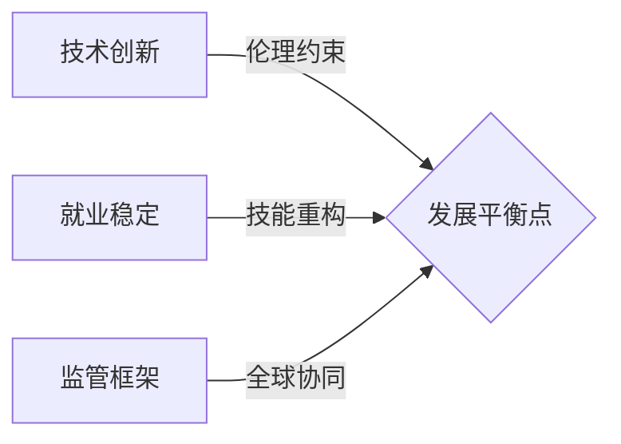

**title**: "2025年人工智能爆发：从监管博弈到教育革命"  
**date**: 2025-07-05  
**author**: "科技前沿观察组"  
**description**: "深度解析2025年全球AI竞争格局：人形机器人量产落地、欧盟监管僵局、教育智能化重构及万亿低空经济崛起"  
**categories**: ["人工智能", "科技创新"]  
**tags**: ["AI监管", "人形机器人", "低空经济", "教育智能化", "生成式AI"]  
**featured_image**: "AI融合应用场景示意图"  

---

# 2025年人工智能爆发：从监管博弈到教育革命  

  

2025年盛夏，人工智能领域正经历前所未有的剧变：Meta以**3亿美元天价**争夺顶尖AI人才，欧盟110家企业联名抗议《AI法案》，中国低空经济催生**475个机场**新基建，而教育系统正通过智能化重构应对68%公众的信任危机。这场技术革命已从实验室跃进至产业爆发与制度重构的深水区。

---

## 一、产业风暴：人形机器人量产与就业重构
### 1. 人形机器人打响"百机大战"
- **灵犀X2亮相**：中国团队研发的机器人实现情感交互与复杂运动，推动服务机器人进入家庭场景  
- **量产竞赛**：全球近150家企业角逐市场，特斯拉Optimus-Gen 2物理操控精度达毫米级  
- **工业融合**：百度、阿里工业大模型优化产线决策，故障预测准确率提升40%  

### 2. 白领岗位遭遇替代危机
- **微软裁员**：AI替代Xbox等部门数千岗位，占总数4%  
- **职业重构**：摩根大通、亚马逊证实AI处理30-50%企业任务，会计、客服成重灾区  
- **新职业诞生**：提示工程师、AI伦理师年薪突破百万，荷兰再培训需求激增  

---

## 二、监管博弈：全球AI治理陷入僵局
### 1. 欧盟《AI法案》遭遇强烈抵制
- **110家巨头联名抗议**：ASML、西门子要求法案推迟2年实施，警告"监管扼杀创新"  
- **成本争议**：企业合规支出预估超营收8%，中小企业生存受威胁  

### 2. 中美分化发展
- **中国专利崛起**：2024年占全球60%生成式AI专利，开源模型加速出海  
- **美国州自治**：联邦放权立法，加州强化算法透明度，伊利诺伊州禁AI招聘歧视  
- **经济代价**：欧洲或年损2000亿欧元，中国低成本方案抢占新兴市场  

---

## 三、教育革命：智能化重构教学本质
### 1. 政策驱动体系变革
- **教育强国纲要**：教育部确立2025为"智慧教育元年"，AI融入课程与评价体系  
- **信任重建**：全美高等教育信心10年降21%，EDUCAUSE提出"能力+关怀"双轨战略  

### 2. 教学模式深度迭代  
| 传统模式          | 智能化变革                | 应用案例                     |  
|-------------------|--------------------------|----------------------------|  
| 标准化授课        | ▶ 深度学习分析定制方案    | DeepSeek生成个性化学习路径  |  
| 固定课时          | ▶ 混合教育(面授+远程)     | 国家智慧教育平台2.0上线 |  
| 应试评价          | ▶ 能力导向评估(CBE)       | 微证书认证职场技能     |  

### 3. 师资结构性升级
- **STEM教师扩招**：中小学强制配备理工科硕士科学教师  
- **数字素养培训**：高校教师AI工具使用率达87%  

---

## 四、前沿突破：低空经济与可持续技术
### 1. 低空经济激活万亿市场
- **基建爆发**：全国475个通用机场建设加速，构建"城市空中路网"  
- **场景创新**：  
  - 无人机物流：中航TP500实现灾害物资精准投送  
  - 空中交通：海南试点"空中的士"，通勤效率提升300%  

### 2. 可持续技术突破能源困局
- **超冷材料**：沙特利雅得测试光子降温材料，城市温度降5℃  
- **生物计算**：百图生科xTrimo V3模型加速抗体开发，缩短研发周期70%  

---

## 未来挑战：平衡三角矛盾  

1. **效率VS人道**：微软强制员工使用Copilot引争议  
2. **数据主权VS开放**：欧盟要求AI训练数据本地化遭科技巨头抵制  
3. **教育公平鸿沟**：仅41%乡村学校具备AI教学能力  

> **达沃斯论坛共识**：2025天津夏季达沃斯论坛呼吁建立"AI发展与人类福祉"全球框架，中国提出《数字桥梁倡议》  

---

**参考来源**  
1. 世界经济论坛天津夏季达沃斯报告（2025）  
2. 全球数字经济大会AI融合论坛纪要（2025）  
3. EDUCAUSE《2025十大教育趋势：重建信任》（2024）  
4. 教育部《教育强国建设规划纲要》（2024）  

